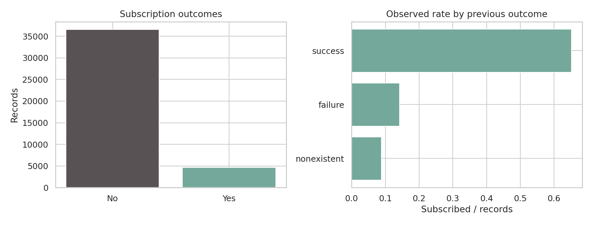
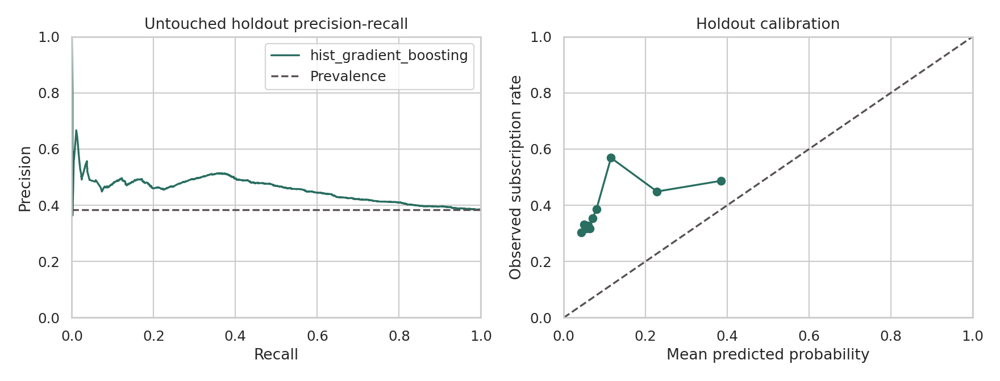
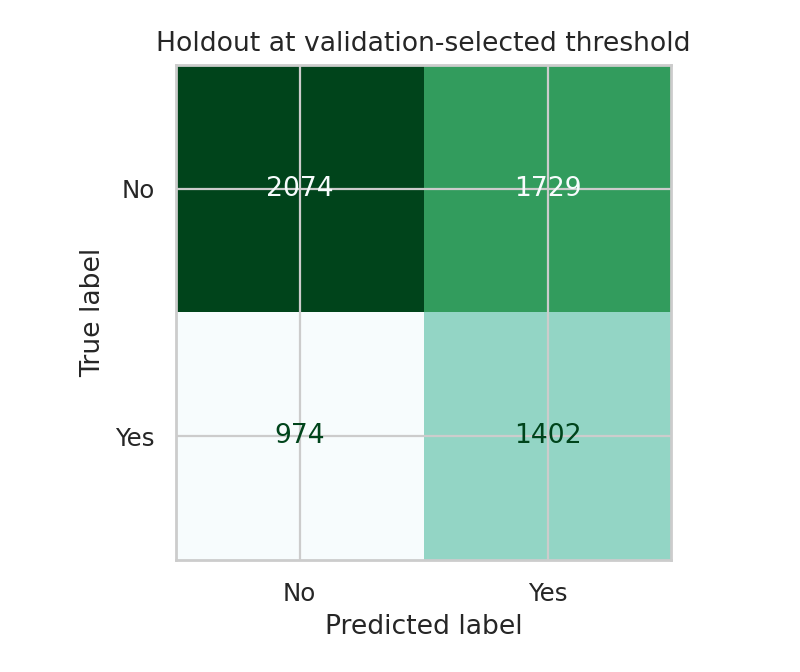
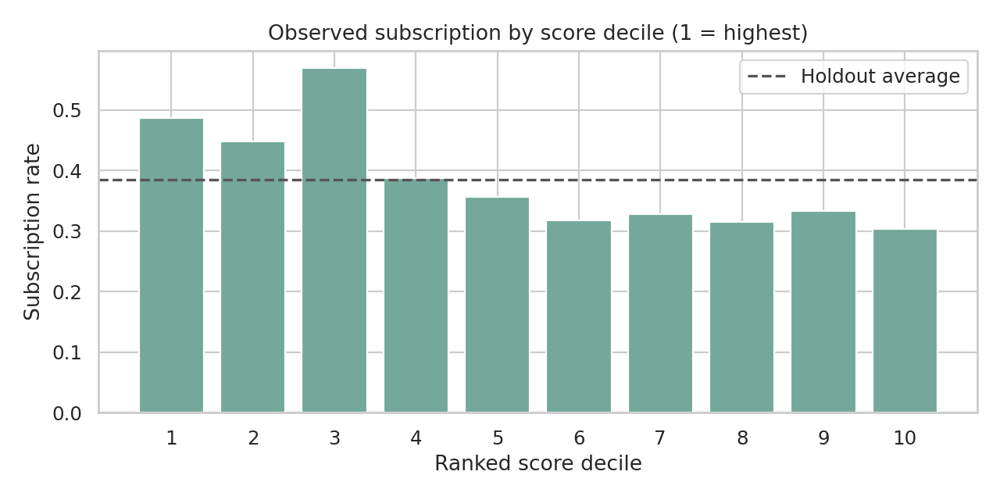
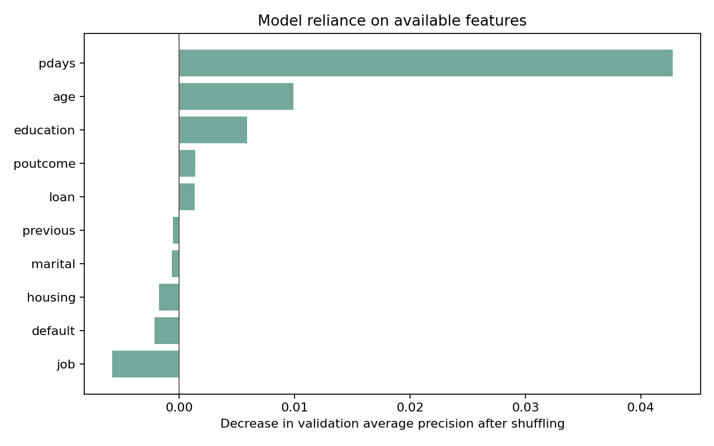

# Bank campaign prioritization | Analysis report

**Portfolio owner: Rajat Kumar · 26 September 2026**

## The problem
A bank can contact only a fraction of a list before its campaign window closes. Which records should be called first, using fields known before the call? This project tests whether a predictive ranker beats a random queue in identifying subscribers, under a fixed capacity of 20%. It does not estimate causal uplift or revenue.

## Data and analysis
The [UCI Bank Marketing data](https://archive.ics.uci.edu/dataset/222/bank+marketing) contains 41,188 rows from Portuguese telephone campaigns, ordered by date, with 4,640 subscriptions (11.27%) in the full file. There are no pandas nulls, though `unknown` is common (e.g., 8,597 instances in `default`); `pdays=-1` encodes no earlier contact. There are 12 fully duplicate rows, retained because no customer ID exists to adjudicate repeat encounters. Previous campaign outcome is highly associated with this one: 65.1% subscription among 1,373 `poutcome=success` rows, against 8.8% among 35,563 `nonexistent` rows. This is an association, not an effect of targeting.

The features are customer descriptors and prior campaign history; duration and current-contact descriptors are dropped to avoid a hindsight model. Numeric imputation/scaling and categorical encoding are learned only from initial training observations. A positional 70/15/15 split respects the source file's order; source data offers no exact timestamps for stricter cutoff validation. The validation slice chooses between weighted logistic regression and histogram gradient boosting on PR-AUC. The latter narrowly wins 0.1899 versus 0.1895, which is not evidence of meaningful superiority. No feature tuning follows that comparison. The last 6,179 rows remain untouched until final evaluation.

## Results and charts

The holdout PR-AUC is **0.4547**, ROC-AUC **0.5843**, and Brier **0.3089**. These must be read beside the 38.45% holdout subscription rate, up from 5.57% in training and 10.65% in validation. The top-scoring 20% of holdout cases identify **578 subscribers in 1,236 calls**, a 46.76% positive rate against the holdout's 38.45%: **1.22x lift**, capturing 24.33% of subscribers. This is a limited ranking gain, not a reliable profit number. In validation, the same capacity yields 1.84x lift. The data's temporal shift reduces confidence in deploying the ranker unchanged.

A threshold learned for top 20% on validation (`0.0665`) selects 3,131 / 6,179 test cases (50.7%). So if the actual constraint is call capacity, re-rank each prospective batch and take a fixed top fraction; do not equate a stale score threshold to a staffing plan. The corresponding confusion matrix is in `outputs/metrics.json` and chart 03. Raw scores are not calibrated enough to be quoted as true probabilities.

## Explainability and batch demo
The grouped permutation chart measures how shuffling a pre-call feature changes average precision on 1,200 fixed validation rows, repeated three times. This is a model-reliance diagnostic, not an explanation of why an individual subscribed or proof that changing a feature would help. Correlated features can mask one another. `predict.py` uses the locally saved model to rank another CSV at a chosen capacity; its scores are uncalibrated, and the flagged queue is for review only.

## Decision and next experiment
A small prospective shadow deployment could rank *eligible* contacts without changing who gets contacted. Compare decisions and calibration by period, channel and approved customer segments, then run a randomized trial for causal incremental conversion. Agree on call cost, product margin, consent/exclusion lists and capacity before converting lift to ROI. Revalidate using customer IDs and event times if the bank has them; without those, repeat-contact leakage cannot be fully ruled out. Check whether prior-campaign features and sensitive descriptors are actually lawful and available at scoring time. This historical dataset (2008–2010) is not representative of today's banking, and results should not be sold as current operational performance.

**Source:** Moro, S., Rita, P. & Cortez, P. (2014), [Bank Marketing, UCI Machine Learning Repository](https://archive.ics.uci.edu/dataset/222/bank+marketing), [DOI 10.24432/C5K306](https://doi.org/10.24432/C5K306). Figures and metrics reproduced by `python analysis.py`.
